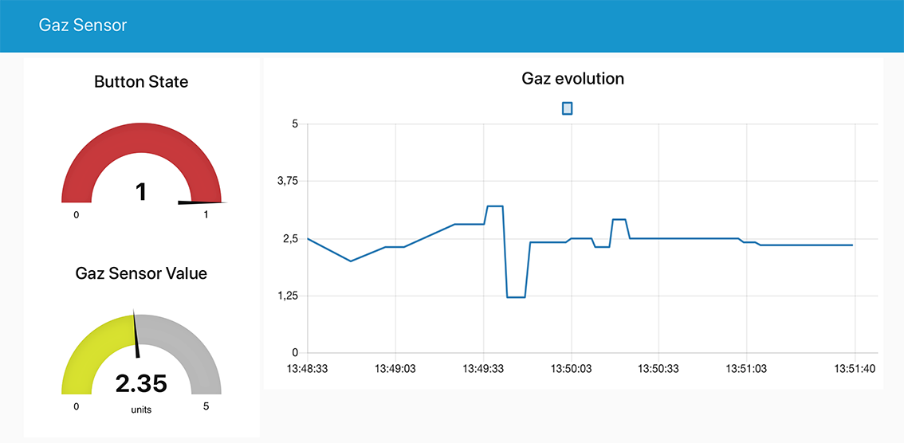
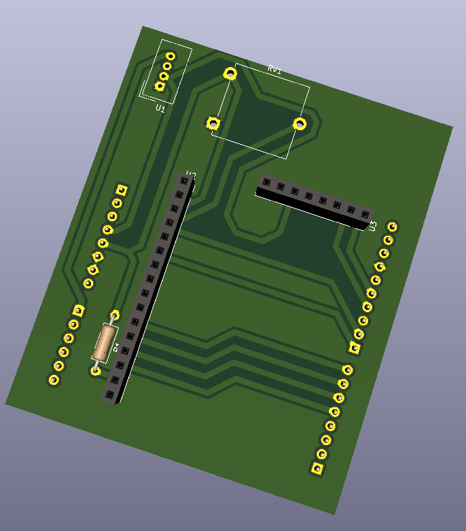

# LAMAMG-gaz-sensor

> A Smart Gaz Sensor that just works.

[![Node-Red Version][node-red-image]][node-red-url]
[![Node-Red-Dashboard Version][node-red-dashboard-image]][node-red-dashboard-url]
[![Node-Red-TTN Version][node-red-ttn-image]][node-red-ttn-url]
[![Arduino-TTN Version][arduino-ttn-image]][arduino-ttn-url]


The result of our project can be seen on the following picture, which is a screenshot of our application's dashboard.



Our application is simple:
- we collect data through a gaz sensor connected to an Arduino board
- then, we send it to a NodeRed serving using TTN and LoRa
- once the data is received by the server, the dashboard is updated
- the values are displayed separately (two gauges for the sensor & the button state values, one chart for the evolution of the sensor value)

As of now, the button is purely decorative (it once served to send data when at '1').   



We designed our own Arduino shield using the KiCad software. It directly connects to the Arduino board used (101). 
On it, you can add the following devices:
- a Grove LCD screen (http://wiki.seeedstudio.com/Grove-LCD_RGB_Backlight)
- a potentiometer
- a Grove gaz sensor (http://wiki.seeedstudio.com/Grove-Gas_Sensor)
- our homemade gaz sensor (with an integrated AOP)
- the RN2483 LoRa transceiver module and its board (https://www.microchip.com/wwwproducts/en/RN2483) 

## Installation

OS X & Linux:

```bash
sudo apt install nodejs npm
npm install node-red node-red-ttn node-red-dashboard
cp NodeRED/flows.json ~/.node-red/flows.json
node-red &
```

Then the Dashboard will be visible on http://localhost:1880/ui, and the admin page
will be available on http://localhost:1880.

## Usage example

Power up the Arduino next to a LoRa Gateway which is using The Things Network.
Then connect to http://localhost:1880/ui on the device running Node-Red, and watch
the gauges and the graphs updated in real-time.

## Dependencies

* Node-RED
    * node-red
    * node-red-dashboard
    * node-red-contrib-ttn
* TTN - The Things Network Account
* Arduino
    * Arduino Compiler
    * The Things Network Library
    * Software Serial Library

## Development setup

### NodeRED
Follow the Instllation section, and visit the http://localhost:1880/ with your
favorite browser. You can here change the flows linked to the Dashboard.
Please update the default NodeRED flow to `~/path/to/directory/NodeRED/flows.json`
into the `~/.node-red/settings.json` file before modifying the flows.

### KiCad
The PCB has been designed on KiCad. To contribute to it, you should install it on
[here](http://kicad-pcb.org/download/).
You will then find the KiCad project into the `Kicad/shield` directory.

### Arduino code
The Arduino Code has been developped on _Arduino IDE_ which can be
downloaded [here](https://www.arduino.cc/en/Main/Software). You may need
to fix the dependencies you'll find in the Dependencies' section.
You can easily find them into the package manager of the IDE.

## Contributors
 
 | Name           | Contact                        |
 |----------------|--------------------------------|
 | Maxime Grac    | grac@etud.insa-toulouse.fr     |
 | Lucas Audibert | l_audibe@etud.insa-toulouse.fr |
 | Adrien Marty   | a_marty@etud.insa-toulouse.fr  |

Distributed under the MIT license. See ``LICENSE`` for more information.

## Contributing

1. Fork it (https://github.com/MOSH-Insa-Toulouse/LAMAMG-gaz-sensor.git)
2. Create your feature branch (`git checkout -b feature/fooBar`)
3. Commit your changes (`git commit -am 'Add some fooBar'`)
4. Push to the branch (`git push origin feature/fooBar`)
5. Create a new Pull Request

<!-- Markdown link & img dfn's -->
[node-red-image]: https://img.shields.io/badge/node--red-v0.19.5-orange.svg
[node-red-url]: https://nodered.org
[node-red-dashboard-image]: https://img.shields.io/badge/node--red--dashboard-v2.9.8-orange.svg
[node-red-dashboard-url]: https://github.com/node-red/node-red-dashboard
[node-red-ttn-image]: https://img.shields.io/badge/node--red--ttn-v2.0.4-orange.svg
[node-red-ttn-url]: https://www.npmjs.com/package/node-red-contrib-ttn
[arduino-ttn-image]: https://img.shields.io/badge/TTN_Arduino-v2.5.13-orange.svg
[arduino-ttn-url]: https://github.com/TheThingsNetwork/arduino-device-lib
